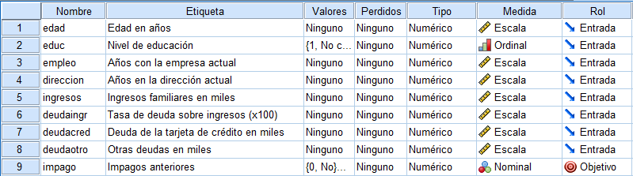

```{r setup, include=FALSE}
knitr::opts_chunk$set(echo = TRUE)
set.seed(12345)

library(readxl)
library(dplyr)
library(readxl)
library(ROSE)
library(caTools)
library(data.table)
library(ROCit)
library(party)
library(flextable)
library(officer)
library(graphics)
library(kableExtra)
```
# 1. Resumen

<div align='justify'><div align='justify'>El presente  trabajo presenta los modelos de Scoring con las metodologías más utilizadas, haciendo uso de atos de solicitudes de clientes , para adquirir prestamos bancarios. Se construye
un modelo de Scoring a partir de la metodología logit. Como variables independientes, se
incluyen las  variables que recogen características del cliente,tales como edad, educación, ingresos, etc. Posteriormente, se evalúa el poder predictivo y la estabilidad del modelo a través del estadístico de Kolmogorov y Smirnov y la información de valor inicial . Adicionalmente, se dispone de una
muestra de clientes  los cuales son identificados si han incumplido o no sus pagos penditentes , El comportamiento del cliente  será inferido individualmente en
función de sus características. El modelo final incluye esta muestra  y es comparado con el modelo inicial.</div>

# 2.Introducción 

<div align='justify'>La actividad financiera se ha incrementado enormemente en las últimas décadas, debido a
diversos factores como la globalización, el creciente uso de internet o la creación de distintos
tipos de productos financieros. Sin embargo, toda rentabilidad trae consigo un riesgo del que
las entidades financieras deben protegerse.
A medida que los bancos están cada vez más interconectados entre sí , y crece su
expansión geográfica, se hace más necesario reforzar la regulación de su actividad. Esta
regulación es muy estricta, debido a que las entidades bancarias tienen cada vez más
influencia en la sociedad, y su objetivo es mantener una estabilidad monetaria y financiera, así
como la protección del cliente.
Es por ello que una entidad financiera debe identificar los riesgos a los que está expuesta, debe
saber medirlos y ser capaz de minimizarlos o protegerse de ellos en caso de que sea necesario.
Los riesgos a los que se enfrenta se agrupan en cuatro grandes bloques: riesgo de mercado, riesgo de crédito, riesgo de liquidez y riesgo operacional.
Todos ellos afectan en mayor o menor medida a una entidad bancaria.

El riesgo de crédito es en el que se va a centrar principalmente este trabajo. Se refiere a
pérdidas ocasionadas por la imposibilidad del deudor de hacer frente al pago de la deuda que
ha contraído con la entidad financiera. Las pérdidas que puede ocasionar este tipo de crédito
son muy importantes para un banco, puesto que la concesión de créditos es una de sus
fuentes principales de rentabilidad. Para hacer frente a este riesgo, la regulación impone una
serie de parámetros que los bancos deben calcular periódicamente, y en función a éstos,
almacenar una cantidad de capital, (un colchón) que permita mitigar las posibles pérdidas.

Una de las formas que tiene un banco de protegerse del riesgo de crédito
consiste en establecer una política de concesión de préstamos. Un modo de llevar a cabo esta
medida es a través de modelos de Scoring, que permiten evaluar al cliente previamente, y
tomar una decisión basada en resultados estadísticos.</div>

# 3. Definiciones generales

## 3.1 Modelo Scoring

<div align='justify'>Un modelo de scoring (Mester, 1997) es un método de evaluar el riesgo de crédito de
solicitudes de préstamos (scoring de admisión) o de préstamos ya concedidos anteriormente
(scoring de comportamiento). El objetivo es aislar el efecto de una serie de características
personales o propias del producto en la probabilidad de impago del cliente, utilizando datos
históricos y técnicas estadísticas. El modelo da como resultado una puntuación o "score" que
el banco puede utilizar para calificar al cliente y tomar una decisión respecto a la concesión o no.
Para ello se utiliza información histórica de la entidad de créditos concedidos que han
resultado en impago, créditos concedidos que han acabado satisfactoriamente y créditos no
concedidos a los que se les estimará un comportamiento.

Un buen modelo de scoring es aquel que identifica como buenos a los clientes que no
causaron incidencias en el pago del crédito, e identifica como malos a aquellos que no fueron
capaces de pagar. Es asumible que el modelo cometa errores y califique como buenos a
clientes que han entrado en default. Por ello es importante realizar análisis adecuados que
permitan minimizar dichos errores.</div>

## 3.2 Metodologías Scoring

<div align='justify'>Hay diversas metodologías que se utilizan para desarrollar modelos de scoring. Desde modelos
lineales de probabilidad hasta modelos de valoración de opciones y redes neuronales.
Dentro de los modelos lineales de probabilidad se encuentran los logit y los probit. Son de las
técnicas más comunes para modelizar probabilidades de default en base a características
históricas del cliente y datos históricos de crédito. Ambas técnicas asumen una relación lineal
entre el default y las variables independientes. La metodología logit asume que la
probabilidad de default sigue una distribución logística. Por el contrario, la metodología probit
asume que la probabilidad de default tiene una distribución normal.
Otra de las metodologías para el modelo de scoring de crédito es el análisis discriminante, que
en lugar de devolver una probabilidad de default, divide la muestra entre clientes de alto
riesgo y clientes de bajo riesgo. Se trata de encontrar factores explicativos que permitan
distinguir a un grupo de otro.
Estas tres tipologías mencionadas anteriormente son las metodologías clásicas de scoring.</div>

# 4. Creación del Modelo 

<div align='justify'>Esta sección explica detalladamente los pasos seguidos para la obtención del modelo de scoring para un préstamo bancario.</div>

### 4.1 Variable **Default**

<div align='justify'>Para poder realizar un modelo de scoring, cuyo objetivo es identificar a clientes malos y
separarlos de los buenos, es necesario establecer una definición de qué es bueno y qué es
malo. En esta definición, entran en juego dos factores: los días de atraso en un pago para
considerar a un cliente como moroso, y el desempeño, que es la ventana temporal en la que se
observará la peor situación de dicho cliente. Los días de atraso determinan si un cliente es
moroso o no.

En nuestro trabajo la variable default tendrá  el valor de 1 si el cliente ha caído en  mora y 0 si no.</div>


### 4.2 Descripción de la muestra

<div align='justify'>La base de datos fue extraida de spss , poseé un total de 850 datos y   presenta información personal del cliente (edad, educacion, dirección , ingresos , etc.) . De cada cliente se observa además, en caso   de que haya tenido un impago o no. En los 850 datos hay un total de 183  clientes con impagos , y 517 clientes sin impagos, de estos datos se filtraron  150 datos que aún no han sido calificados, estos fueron extraidos de la muestra dando un total de 700 datos para trabajar.

Para la modelación y verificación del modelo se realizo un muestreo estratificado, es decir del total de la muestra se separó todos los clientes con impagos ($malos$) y sin impagos ($buenos$) y se tomo el 80% de datos de cada uno de ellos, el otro 20 % de estos datos se los tomará para la validación del modelo.

Lo planteado anteriormente se verá implementado en el lenguaje de R con el siguiente código:</div>
```{r warning=FALSE}
library(readxl)

Data <- read_excel("bankloan.xlsx")

# Se apartan los 150 datos sin impagos de la base para futura calificación
df<-Data %>% dplyr::filter((is.na(Data$impago)))
Data<-Data %>% dplyr::filter(!(is.na(Data$impago))) 

#define a la variable default impago como categórica
Data$impago <- as.factor(Data$impago)  
 

Data<-Data%>%select(.,-c(morapred1,morapred2,morapred3))
kable(head((Data)),"latex")%>%
  kable_styling(position = "center")


buenos <- Data %>% dplyr::filter(impago==0)
malos <- Data %>% dplyr::filter(impago==1)

#Estratificación de la muestra 

sample1 <- sample.split(buenos$edad,0.8) # Se toma el 80% de bueno 
sample2 <- sample.split(malos$edad, SplitRatio = 0.8) # Se toma el 80% de malos 

# mod sera la partición de la base para el modelamiento, junta las submuestras anteriores 
mod <- rbind(subset(buenos, sample1 == TRUE),subset(malos,sample2==TRUE))

# val sera la partición de la base usada para la validación del modelo 20%
val <- rbind(subset(buenos, sample1 == FALSE),subset(malos,sample2==FALSE))
```
### 4.2.1 Identificación de variables categóricas y numéricas

<div align='justify'>Se considera la información proporcionada por la base de spss llamada "bankloan"




De aquí se tiene que las variables categóricas son: educación e impago,   mientras que las numéricas son: edad, empleo, direccion, ingresos, deudacred, deudangr, deudaotro.

La implementación para esta sección es la siguiente:</div>

```{r}
muestra<-mod
muestra$educ <- as.factor(muestra$educ)
kable(head(muestra),"latex")%>%
  kable_styling(position = "center")

#Extraemos el nombre de las variables de la muestra
dvars <- colnames(muestra)

#Las separamos en variables numéricas 
vnum <- colnames(muestra[, dvars])[unname(sapply(muestra[, dvars], class))!="factor"]

#Y aquellas variables que sean categóricas
vcat <- colnames(muestra[, dvars])[unname(sapply(muestra[, dvars], class))=="factor"]

#Extraemos la base de solo variables numéricas
dnum <- muestra[, vnum]
dnum$impago <- NULL
kable(head(dnum),"latex")%>%
  kable_styling(position = "center")

#Extraemos la base con solo las variables categóricas
dcat <- muestra[, vcat]
kable(head(dcat),"latex")%>%
  kable_styling(position = "center")
```

### 4.3 Análisis Univariante

<div align='justify'>En este apartado se realiza el análisis univariante de las variables más explicativas para el
evento de default .
Las funciones que se utilizarán para el análisis son la función de valor de información para variables categóricas y el test de Kolmogorov y Smirnov para las variables numéricas.</div>


#### 4.3.1 Función valor de información (VI)

 <div align='justify'>El Valor de información es una medida de entropía muy popular en la construcción de scorecards.
Con este estadístico se puede medir el poder de predicción de agrupar los atributos de una
variable. Además, es un buen indicador a la hora de seleccionar variables para un modelo de
regresión logística binario, como es el caso de un modelo de scoring.

Generalmente, se establecen los siguientes criterios en cuanto al valor de informción (VI) :

<ul>
 <li>Menor a 0,02: La variable no es predictiva. </li>    
    <li>Entre 0,02 y 0,1: La variable es débilmente predictiva. </li>
    <li>Entre 0,1 y 0,3: La variable es predictiva media. </li>
<li>Más de 0,3: La variable es fuertemente predictiva.</li>
</ul>


La implementación de la función es la siguiente:</div>

```{r}

# Valor de informacion (IV)
TestVI <- function(x,y){
  if(class(x)=="character"){
    tc <- table(y,x)
    f1 <- tc[1,]
    f2 <- tc[2,]
    aux1 <- ifelse(f1/sum(f1)==0,0.001,ifelse(f1/sum(f1)==1,0.999, f1/sum(f1)))
    aux2 <- ifelse(f2/sum(f2)==0,0.001,ifelse(f2/sum(f2)==1,0.999, f2/sum(f2)))
    wof <- log(aux2/aux1)
    wof <- ifelse(wof==-Inf,0,wof)
    VI <-   sum(((f2/sum(f2))-(f1/sum(f1)))*wof)
  }else{
    VI <- 0
  }
  return(VI)
}

```
#### Cálculo de VI sobre las variables categóricas

<div align='justify'>No se tendrán en cuenta para el modelo aquellas variables cuyo VI sea  mayor que 0,5 porque significa que la variable es sobre predictiva y no se debe tener
en cuenta en el modelo .</div>

```{r}
# Cálculo del VI sobre variables categóricas
VI <- sort(sapply(dcat, TestVI, y=muestra$impago), decreasing = T)
dVI <- data.frame(names(VI), VI)
colnames(dVI) <- c("Variable", "VI"); rownames(dVI) <- NULL

kable(dVI,"latex")%>%
  kable_styling(position = "center")
```
<div align='center'>En este caso se conservan  las variables categóricas.

#### 4.3.2 Test de Kolmogorov-Smirnov

<div align='justify'>Es un test no paramétrico de bondad de ajuste que permite comprobar si dos muestras
independientes tienen la misma distribución. El estadístico se calcula como la máxima
diferencia absoluta entre las funciones de distribución acumuladas empíricas de ambas
muestras, en nuestro caso de los clientes $buenos$ y los clientes $malos$. 
Su implementación es la siguiente:</div>

```{r}
# Funcion KS
TestKS <- function(x, y){
  if(class(x)!="character"){
    vars <- data.frame(y,x)
    vars_e <- subset(vars,subset=vars[,1]==1)
    vars_f <- subset(vars,subset=vars[,1]==0)
    ks <- suppressWarnings(ks.test(vars_e[,2],vars_f[,2],alternative="two.sided"))
    ks <- round(as.numeric(ks$statistic),4)
  } else{
    ks <- 0
  }
  return(ks)
}

# Correlacion superior a un valor dado 
DVarCorr <- function(data, corr.max = 0.90){
  COR.AUX <- cor(data)
  pos <- which(((abs(COR.AUX)>=corr.max) & (row(COR.AUX) < col(COR.AUX))), arr.ind=T)
  if(nrow(pos)>0){
    col_elim <- numeric(nrow(pos))
    for(i in seq(1:nrow(pos))){
      aux_col_elim <- c(pos[i,1],pos[i,2])
      if (!any(col_elim %in% aux_col_elim)){
        col_elim [i] <- pos[i,which.max(c(pos[i,1],
                                          pos[i,2]))]
      }
    }
    if(length(col_elim)>0){
      col_elim <- unique(col_elim[col_elim>0])
      vars <- names(data)[-(col_elim)]
      data <- data.frame(data[,-(col_elim)])
      colnames(data) <- vars
    }
  }
  return(data)
}
```

#### Calculo de K-S sobre variables numéricas

```{r}

# Cálculo de KS sobre variables numéricas
KS <- sapply(seq_along(dnum), function(i){TestKS(dnum[[i]], muestra$impago)})
dnum <- setDT(DVarCorr(setDF(dnum[, order(KS, decreasing = TRUE)])))
KS <- sapply(seq_along(dnum), function(i){TestKS(dnum[[i]], muestra$impago)})
dKS <- data.frame(colnames(dnum), KS); dKS <- dKS[order(dKS$KS, decreasing = TRUE),]
colnames(dKS) <- c("Variable", "KS"); rownames(dKS) <- NULL

kable(head(dKS),"latex")%>%
  kable_styling(position = "center")
```
Bajo la función KS debo considerar las 7 variables numéricas, junto con la variable categórica para la construccion del modelo logit.


# 5. Regresión Logística
<div align='justify'>Una vez que se han analizado las variables tanto numéricas como categóricas de forma
separada y conjunta, serán introducidas en un modelo de regresión logística binaria.

La regresión logística binaria estima la variable dependiente en términos de probabilidad
utilizando la función logit, es decir:


\begin{equation}
\text{log}\left(\dfrac{p}{1-p}\right)=\beta_0+\beta_1x_1+\beta_2 x_2+\dots+\beta_k x_k
\end{equation}
\begin{equation}
\hat{p}=\dfrac{e^Y}{1+e^Y}=\dfrac{1}{1+e^{-Y}}
\end{equation}
\begin{equation}
Y=\hat{\beta}_0+\hat{\beta}_1 x_1+\hat{\beta}_2 x_2+\dots+\hat{\beta}_k x_k
\end{equation}


Una de las ventajas que presenta esta regresión es que permite que las variables
independientes sean cuantitativas, discretas o continuas; o categóricas, sin que hay ninguna
restricción. 
La capacidad predictiva se mide mediante la comparación entre el grupo de pertenencia
observado y estimado por el modelo, que clasifica a los individuos en función de un punto de
corte establecido, que por defecto será 0,5. Es decir, si la probabilidad estimada es mayor a
0,5, el individuo será clasificado como 1, y viceversa. La capacidad predictiva se mide por el
porcentaje de individuos que siendo 0 o 1, el modelo los clasifica como tal.
En este caso, la variable dependiente representa el evento de impago:

-Default=1 si el individuo no ha atendido correctamente a los pagos. El cliente se
clasifica como malo.
-Default=0 si el individuo ha pagado correctamente el crédito. El cliente se clasifica
como bueno.

Es decir, el modelo de regresión logística pretenderá predecir la probabilidad de default</div>

## 5.1 Obtención del modelo 
<div align='justify'>En esta sección ,tomando en cuenta los criterios planteados anteriormente, se eliminaran del modelo las variables que no son explicativas hasta obtener uno o varios 
modelos adecuados, dentro de los cuales se seleccionará el que presente una  mejor clasificación.


Dado los resultados de los test de K-S Y VI, el modelo inicia de la siguiente  manera:


```{r}
modelo <- glm(impago ~ edad+empleo+direccion+ingresos+deudaingr+
                deudacred+deudaotro, 
              family = binomial("logit"), data = mod)
```

```{r echo=FALSE, warning=FALSE}
aux <- summary(modelo)
kable(as.data.frame(aux$coefficients),"latex")%>%   kable_styling(position = "center")
```


Por lo cual se excluye del análisis la variable ingresos pues se rechaza con una significancia de 0.66

```{r}
modelo <- glm(impago ~ edad+empleo+direccion+deudaingr+
                deudacred+deudaotro, 
              family = binomial("logit"), data = mod)
```

```{r echo=FALSE, warning=FALSE}
aux <- summary(modelo)
kable(as.data.frame(aux$coefficients),"latex")%>%   kable_styling(position = "center")
```
Por lo cual se excluye del análisis la variable $deudaotro$, pues sibrepasa su p valor a 0,5 y es el más alto 

```{r}
modelo <- glm(impago ~ edad+empleo+direccion+deudaingr+
                deudacred, 
              family = binomial("logit"), data = mod)
```

```{r echo=FALSE, warning=FALSE}
aux <- summary(modelo)
kable(as.data.frame(aux$coefficients),"latex")%>%   kable_styling(position = "center")
```


## 5.2 Interpretación de Coeficientes


En un modelo de regresión logistica es importante considerar dos aspectos:

* _Signo del coeficiente $\beta_t$ :_ Si $\beta_t$  es positivo: Los Incrementos en  la variable independiente $x_i$ supone aumentar  la probabilidad de pertenecer al grupo de interes $Y$
Si $\beta_t$ es negativo : Los Incrementos EN la variable independiente $x_i$ disminuye la probabilidad de pertenecer al grupo de interes $Y$

* _Grado o tamaño: _ Interpreta cuantas veces incrementa un individuo “A”  la probabilidad de pertenecer al grupo de interés si la comparamos con la probabilidad de pertenencia  de otro individuo ”B” .
Este factor viene dado por $e^{\beta_t}$

Para nuestro modelo tenemos las siguientes interpretaciones: 

```{r}
modelo

``` 
* _Signo de coeficientes:_ Los coeficientes de las variables edad , deudaingr y deudacred son positivos es decir que mientas más aumentes estas variables mayor es la posibilidad de clasificarlos en el grupo de interés , es decir un aumento en las deudas que adquiere  una  persona , un aumento en la tasa de endeudamiento con respecto al total de sus  ingresos y el aumento en la edad de la persona aumenta la probabilidad de impago .

Por otro lado  Los coeficientes de las variables empleo y direccion  son negativos es decir que mientas una perosna  aumenten los años de mantenerse trabajando en el mismo empleo , y aumente los años de vivir en la misma dirección, entonces la probabilidad de imapgo diminuira.

* _Grupo o tamaño:_
Notemos que cuando $\beta_t$ es negativo el valor del fator $e^{\beta_t}$ tomara valores entre 0 y 1 mientras que cuando $\beta_t$ es positivo el valor del fator $e^{\beta_t}$ tomara valores mayores que la unidad .


Esto quiere decir que por ejemplo: Para la variable edad  si comparamos a dos individuos con edad de 30 años y comparamos con otro individuo de edad 31 años , cada vez que el individuo aumenta un añode vida,  la probabilidad de impago del individuo crece un (1-$e^{\beta_t}$)


## 5.3 Validación y estabilidad del modelo

Previo a validar nuestro modelo, se realizan predicciones con la base de datos de modelamiento $mod$
```{r}
#Predicciones del modelo con la data de modelamiento (mod)
res <- predict(modelo, mod, type="response")
res <- ifelse(res > 0.5, 1, 0) # Punto de corte en 0.5
```

### Matriz de confusión 
Una matriz de confusión es una herramienta que permite la visualización del desempeño de un algoritmo que se emplea en aprendizaje supervisado. Cada columna de la matriz representa el número de predicciones de cada clase, mientras que cada fila representa a las instancias en la clase real. Uno de los beneficios de las matrices de confusión es que facilitan ver si el sistema está confundiendo dos clases.

```{r echo=FALSE}
# Matriz de confusión (Proporción de predicciones correctas)
mc <- table(res, mod$impago)
#mc[1,1] # Verdaderos positivos
#mc[2,2] # Verdaderos negativos
#mc[1,2] # Falsos positivos
#mc[2,1] # Falsos negativos

kable(mc,"latex")
kable(mc/sum(mc),"latex")

```
*Interpretación:* Bajo nuestro modelo logit, el modelo ha calificado como buenos a 371 clientes que en efecto coincidían con ser buenos clientes, sin embargo nuestro modelo se equivoca dando falsos positivos para 68 clientes es decir, las características de estos 68 clientes hacen que el modelo logit propuesto los califique como buenos sin embargo eran clientes que entraron en mora.

Por otra parte, el modelo considera 104 clientes como malos de los cuales: 30 resultaron ser buenos clientes y los 74 restantes en efecto coincidieron en ser malos clientes.

Finalmente, se observa que clasifica con verdaderos positivos al 68$\%$ y con verdaderos negativos al 14$\%$

### Estadístico R cuadrado 

El valor de $R^2$ es: `r (mc[1,1]+mc[2,2])/sum(mc)`.


*Interpretación:* El estadístico R cuadrado determina la calidad del modelo para replicar los resultados, y la proporción de variación de los resultados que puede explicarse por la regresión. Dado que nuestro valor es cercano a 0.82 tenemos un ajuste adecuado para la variable Default

### Curva ROC 
es una representación gráfica de la sensibilidad frente a la especificidad para un sistema clasificador binario según se varía el umbral de discriminación. Otra interpretación de este gráfico es la representación de la razón o ratio de verdaderos positivos (VPR = Razón de Verdaderos Positivos) frente a la razón o ratio de falsos positivos (FPR = Razón de Falsos Positivos) también según se varía el umbral de discriminación (valor a partir del cual decidimos que un caso es un positivo). 

Para nuestro modelo el gráfico de la curva Roc es el siguiente

```{r echo=FALSE}
###### Curva ROC MODELAMIENTO
dres <- data.frame(pred=predict(modelo, mod, type="response"), var=mod$impago)
ROC <- rocit(score=dres$pred, class=dres$var)
plot(ROC)
ksplot(ROC)
```

*Interpretación: *Dado que la sensibilidad es la fracción de verdaderos positivos y la especificidad la fracción de verdaderos negativos, nuestra curva ROC representa la sensibilidad del modelo frente al valor que se obtiene al restar la especificidad a la unidad (1-especificidad).

Lo esperado en una curva ROC es que crezca rapidamente hacia el valor de sensibilidad 1 y dado que nuestro punto optimo se encuentra cerca del valor de especificidad del 0,2 se puede afirmar que el modelo es adecuado.


### Validación modelo original
Realizamos el mismo análisis con los datos apartados para la validación del modelo y tenemos los siguientes resultados:

```{r}

#Predicciones del modelo con la data de validación (val)
res <- predict(modelo, val, type="response")
res <- ifelse(res > 0.5, 1, 0) # Punto de corte en 0.5
```

```{r echo=FALSE}
# Matriz de confusión (Proporción de predicciones correctas)
mc <- table(res, val$impago)
#mc[1,1] # Verdaderos positivos
#mc[2,2] # Verdaderos negativos
#mc[1,2] # Falsos positivos
#mc[2,1] # Falsos negativos

kable(mc,"latex")
kable(mc/sum(mc),"latex")
```

Se tiene un $R^2$ de `r (mc[1,1]+mc[2,2])/sum(mc)`.

```{r echo=FALSE}
dres <- data.frame(pred=predict(modelo, val, type="response"), var=val$impago)
ROC <- rocit(score=dres$pred, class=dres$var)
plot(ROC)
ksplot(ROC)
```

## Comparación:

Tras la validación del modelo, se evidencia que continua discriminando de forma correcta los clientes que verdaderamende son buenos sin embargo tenemos un porcentaje de falsos positivos del 14$\%$ es decir que los califica como buenos pero en realidad resultan ser malos, lo cual puede ser de alto riesgo para una entidad bancaria. Sin embargo, observamos que la discriminación de los clientes malos continua siendo aceptable y ademas en la validación tenemos un $R^2$ de 0.796 lo cual continua siendo un ajuste adecuado del modelo.


### Predicciones del modelo con la data apartada de 150 clientes para calificar (val)

```{r}
pronostico <- predict(modelo, df, type="response")
calificacion <- ifelse(pronostico > 0.5, 1, 0) # Punto de corte en 0.5

resultado<-data.frame(df,pronostico,calificacion)

resultado<-resultado%>%select(.,-c(educ,ingresos,deudaotro,morapred1,morapred2,morapred3))

resultado
```


# 6. Árboles de clasificación

Es un árbol de desición en donde  los nodos representan datos en lugar de decisiones. Cada ramificación contiene un conjunto de atributos o reglas de clasificación asociadas a una etiqueta de clase específica, que se halla al final de la ramificación.
Cada dato adicional ayuda a que el modelo prediga de forma más precisa a qué conjunto finito de valores pertenece el asunto en cuestión. Esa información se puede usar posteriormente como una entrada en un modelo más grande de toma de decisiones.


```{r echo=FALSE}

arbol <- ctree(impago ~ edad+empleo+direccion+deudaingr+
                deudacred, data=mod)
plot(arbol, type="simple")

```


*Interpretación de los criterios de clasificación*
Para la interpretacion se referira como  "clientes buenos" a aquellos que no han tenido impagos y como "clientes malos" a aquellos que si han tenido.Consideramos un total de 543 personas correspondientes al 80% de nuestra muestra de 700  datos.

En el primer nodo tenemos la variable "deudaingr" que determina el porcentaje de deuda sobre el total de ingresos, vemos que 128 personas fueron clasificadas con mas del 14,4% de deuda con respecto a sus ingresos, dentro de las cuales fueron considerados como  "buenos" el 41,4% y como "malos" al 58,6%.

El 94,1% de un total de 68 personas  que han trabajado más de 10 años con la empresa actual con   mas de 1195 dolares de deuda y un porcentaje de deuda con respecto a sus ingresos menor al 14,4% , feueron calificadas como buenas, y el 5,9% restante fueron clasificados como malos. 

El 63,6% de un total de 68 personas que  han trabajado menos de 10 años con la empresa actual con   mas de 1195 dolares de deuda y un porcentaje de deuda con respecto a sus ingresos menor al 14,4% , fueron calificadas como buenas, y el 36% restante  fueron clasificados como malos.

El 96,7% de 184 personas que tienen una deuda menor a 1195 dolares, que han trabajado mas de 4 años con la empresa actual y con un porcentaje de deuda con respecto a sus ingresos menor al 14,4% , han sido calificadas como buenas, y el 4,3% restante como malos. 

Ell 91,9% de 37 personas que han vivido mas de 8 años en la misma dirección actual , que se han mantenido trabajando 4 años o menos en la empresa actual y que presentan un porcentaje de deuda con respecto al total de sus ingresos menor al 14,4% han sido calificadas como buenas el 8% restante han sido calificados como malos.

El 57,7% de 104 personas que han vivido menos  de 8 años en la misma dirección actual , que se han mantenido trabajando 4 años o menos en la empresa actual y que presentan un porcentaje de deuda con respecto al total de sus ingresos menor al 14,4% han sido calificadas como buenas el 8% restante han sido calificados como malos.

### Conclusiónes con respecto a árboles de desiciones:
Emplear los árboles de decisión en el aprendizaje automático tiene numerosas ventajas y desventajas , entre ellas están:

*El costo del uso del árbol para predecir los datos disminuye con cada punto de datos adicional.
*Funciona para los datos numéricos o categóricos.
*Puede modelar problemas con múltiples resultados.
*Usa un modelo de caja blanca (lo que hace que los resultados sean fáciles de explicar).
*La fiabilidad de un árbol se puede cuantificar y poner a prueba.
*Tiende a ser preciso independientemente de si viola las suposiciones de los datos de origen.
*Cuando se presentan datos categóricos con múltiples niveles, la información obtenida se inclina a favor de los atributos con mayoría de niveles.
*Los cálculos pueden volverse complejos al lidiar con la falta de certezas y numerosos resultados relacionados.


### Conclusiones Generales 


<div align='justify'>El uso de modelos de scoring para evaluar clientes y operaciones destaca el ahorro de tiempo y
recursos, garantiza  que se está aplicando la misma política de aceptación para todos los
clientes, independientemente de sus características personales.
En cuanto al ahorro de tiempo, un modelo de scoring eficiente puede reducir
considerablemente el tiempo requerido para tomar una decisión sobre la admisión o no de un
préstamo. El tiempo que ahorre el modelo dependerá de cuánto confíe el banco en él, y qué
grado de atención quiera emplear en aquellos clientes que se acercan al punto de corte.


Respecto a la objetividad, de cara a la regulación, es importante justificar que no se establecen
criterios de aceptación en base a características personales de índole racial, familiar, de género
o cualquier aspecto con una sensibilidad especial. Un modelo de scoring permite demostrar a
la entidad bancaria, en caso de usar un factor que perjudique en mayor medida a una
población determinada, que dicho factor se está utilizando por motivos de negocio.</div>


#### Limitaciones del modelo Scoring

<div align='justify'>La precisión de sus predicciones dependerá del cuidado con el que se haya construido el
modelo. Si el modelo no se ha calibrado con precisión, las consecuencias
de su uso puede ser muy perjudiciales. La muestra sobre la que se debe desarrollar debe ser
rica en buenos y malos (préstamos que han pagado exitosamente y préstamos fallidos,
respectivamente). Los datos deben ser lo más actuales posibles, y el modelo debe ser revisado
periódicamente para analizar si las relaciones entre variables son similares a las existentes en
el momento inicial.

Schreiner (2002) añade que una de las limitaciones del scoring es que asume que gran parte
del riesgo está relacionado con características observables o cuantificables, como la edad del
cliente, tipo de empleo, etc. En línea con este argumento, según la metodología que se utilice
para calibrar el modelo, se asume que las relaciones entre variables son lineales. Poder
capturar relaciones no lineales entre variables es costoso de llevar a cabo, y el resultado no es
tan comprensible como una tarjeta de puntuación.</div>

